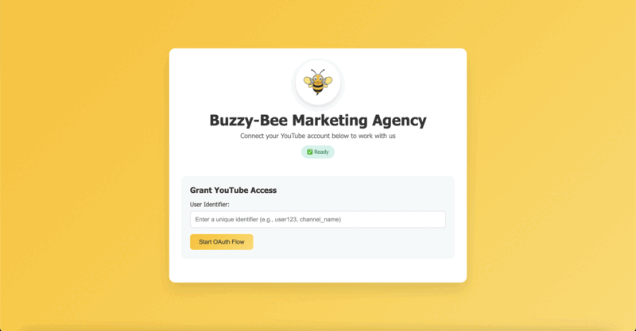

# Bitcast Agency Web Template

**An open-source template for content creator agencies to collect YouTube OAuth tokens for Bitcast Network mining (Subnet 93 on Bittensor).**

This is a **template application** designed for agencies participating in decentralized mining on the [Bitcast Network](https://github.com/bitcast-network/bitcast). The template provides a clean, branded interface for content creators to authorize access to their YouTube accounts. Agencies will earn rewards on behalf of the creators.



*Clean, simple interface with customizable branding - logo, colors, and title can all be configured via environment variables.*

## ⚠️ **Important Notes**

- **Technical Expertise Required:** This template requires knowledge of server administration, domain management, and OAuth setup
- **Template Nature:** This is a starting template meant to be customized with your branding and enhanced with additional security measures
- **No Support:** Open-source project provided as-is with no active support or bug-fixing service
- **Production Ready:** Requires a real domain name and HTTPS for Google OAuth to function

## 📋 **Prerequisites**

### **System Requirements**
- **Docker & Docker Compose** installed on your server
  ```bash
  # Ubuntu/Debian installation
  sudo apt update
  sudo apt install docker.io docker-compose
  sudo systemctl enable docker
  sudo usermod -aG docker $USER  # Log out and back in after this
  ```

### **Server/Firewall Configuration**
- **Open ports:** 80 (HTTP) and 443 (HTTPS)
  ```bash
  # Ubuntu/Debian UFW firewall
  sudo ufw allow 80
  sudo ufw allow 443
  
  # AWS Security Groups: Allow inbound TCP 80 and 443 from 0.0.0.0/0
  # Other cloud providers: Similar inbound rules for ports 80 and 443
  ```

### **Domain & DNS (Required for Production)**
- **Domain name** from any provider (GoDaddy, Namecheap, Cloudflare, etc.)
- **DNS A record** pointing your domain to your server's IP address
- **HTTPS** is automatically handled by Caddy once domain is configured

⚠️ **Critical:** Google OAuth will NOT work without a real domain and HTTPS. Localhost has limitations.

## 🚀 **Setup Guide**

### **1. Clone and Configure**
```bash
# Copy environment template and set your domain
cp env.example .env
echo "DOMAIN=yourdomain.com" > .env  # Replace with your actual domain
```

### **2. Google OAuth Configuration**

**Create Google Cloud Project:**
1. Go to [Google Cloud Console](https://console.cloud.google.com/)
2. Create new project or select existing one
3. Enable APIs: **YouTube Data API v3** and **YouTube Analytics API**

**Configure OAuth Consent Screen:**
1. Go to **APIs & Services → OAuth consent screen**
2. Choose **External** user type
3. Fill required fields (app name, support email, developer contact)
4. **Publish the app** when ready

**Create OAuth Credentials:**
1. Go to **APIs & Services → Credentials**
2. Create **OAuth client ID** → **Web application**
3. Set **Authorized redirect URI:** `https://yourdomain.com/api/oauth/callback`
4. Download the JSON file and save as: `backend/secrets/client_secret.json`

### **3. Deploy**
```bash
chmod +x start.sh
./start.sh
```

### **4. Access Your Application**
- **Production:** `https://yourdomain.com`
- **Development:** `http://localhost`

## 📖 **How to Use**

1. **Launch**
   - Run `./start.sh`
   - Access at `https://yourdomain.com`

2. **Creator Authentication**
   - Share URL with creators
   - They enter ID and connect YouTube account
   - OAuth credentials saved as `backend/secrets/credentials/creds_{user_id}.pkl`

3. **Bitcast Miner Setup**
   - Copy credential files to your miner
   - Configure miner to use these credentials
   - See [Bitcast miner docs](https://github.com/bitcast-network/bitcast)

## 🎨 **Customization**

**Quick Branding Setup:**
```bash
# Add to your .env file
echo "APP_TITLE=YourAgency Creator Onboarding" >> .env
echo "LOGO_PATH=/your-logo.png" >> .env
echo "THEME_COLOR=#your-brand-color" >> .env
```

**Customization Areas:**
- Company logo and colors
- Custom styling and layout
- Branded email templates
- Custom success/error pages

## 🔧 **API Endpoints**

- `GET /api/status` - Service status and configuration
- `GET /api/config` - Application configuration (title, logo, theme)
- `GET /api/oauth/check-setup` - Check OAuth configuration  
- `POST /api/oauth/start` - Start OAuth flow for a user
- `GET /api/oauth/callback` - OAuth callback endpoint (used by Google)

## 🛠️ **Development**

**Project Structure:**
```
├── backend/
│   ├── main.py              # FastAPI application with OAuth management
│   ├── requirements.txt     # Python dependencies
│   └── secrets/
│       ├── client_secret.json        # Google OAuth credentials
│       └── credentials/              # User token storage
├── frontend/
│   └── index.html          # Web interface
├── docker-compose.yml      # Container orchestration
├── Dockerfile             # Container build
├── Caddyfile             # Reverse proxy config
├── env.example           # Environment variables template
├── start.sh              # Start script (preserves certificates)
├── stop.sh               # Stop script
└── reset.sh              # Full reset script (removes all data)
```

## ❗ **Troubleshooting**

### **"Error 400: redirect_uri_mismatch"**
1. Check what your app is sending: visit `https://yourdomain.com/api/status`
2. In Google Cloud Console → APIs & Services → Credentials → Your OAuth Client ID
3. Add the exact URI shown, including `https://` and `/api/oauth/callback`
4. Wait 2-3 minutes for changes to propagate

### **"OAuth doesn't work"**
- Ensure you have a real domain with HTTPS configured
- Verify DNS A record is pointing to your server
- Check that OAuth credentials file exists at `backend/secrets/client_secret.json`

## 📄 **License & Contributing**

**License:** MIT License - see `LICENSE` file for details.

**Contributing:** Contributions welcome! Please review existing issues, follow security best practices, test thoroughly, and document new features clearly.

**Disclaimer:** This software is provided "as-is" without warranty. Users are responsible for implementing security measures, compliance, user consent, and following YouTube API Terms of Service.
