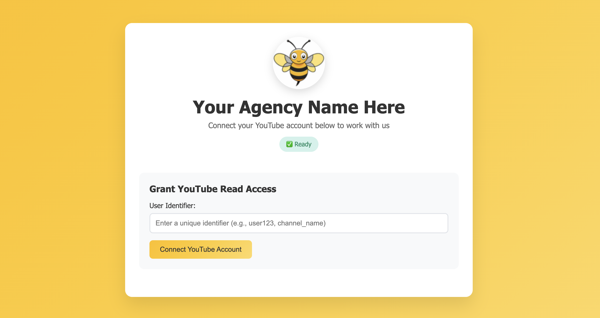

# YouTube OAuth Manager Template

**An open-source template for content creator agencies to collect YouTube OAuth tokens for Bitcast Network mining (Subnet 93 on Bittensor).**

This is a **template application** designed for agencies working with YouTubers and content creators who want to participate in decentralized AI mining on the Bitcast Network. The template provides a clean, branded interface for content creators to safely authorize access to their YouTube accounts.

## 📸 **Screenshot**



*Clean, modern interface with customizable branding - logo, colors, and title can all be configured via environment variables.*

## 🎯 **Use Case**

This template is designed for:
- **Content creator agencies** managing multiple YouTube channels
- **Agencies recruiting YouTubers** for Bitcast Network participation  
- **Organizations** needing secure YouTube OAuth token collection
- **Developers** building custom creator onboarding solutions

## ⚠️ **IMPORTANT DISCLAIMERS**

### 🔒 **Security Notice**
**THIS IS A BASIC TEMPLATE** - Before production use, you MUST:
- ✅ Implement proper authentication/authorization for admin endpoints
- ✅ Add rate limiting and abuse protection
- ✅ Secure credential storage with encryption at rest
- ✅ Implement audit logging for all OAuth operations
- ✅ Review and enhance security based on your specific needs
- ✅ Comply with YouTube API Terms of Service
- ✅ Implement proper user consent and data handling procedures

### 📋 **Legal & Compliance**
- **User Consent Required:** Ensure proper consent from content creators
- **YouTube ToS Compliance:** Review YouTube API Terms of Service
- **Data Protection:** Implement GDPR/CCPA compliance if applicable
- **Transparency:** Clearly communicate data usage to participants
- **Template License:** This is provided as-is for customization and enhancement

### 🏗️ **Template Nature**
This is a **starting template** intended to be:
- **Customized** with your branding and requirements
- **Enhanced** with additional security measures
- **Modified** to fit your specific workflow
- **Extended** with features relevant to your use case

**NOT production-ready out of the box** - requires security hardening and customization.

## ⚠️ **REQUIREMENTS FOR PRODUCTION**

**🌐 Domain Required:** Google OAuth requires HTTPS, which means you **MUST** have:
- A **purchased domain name** (e.g., `yourdomain.com`, `oauth.yourdomain.com`)
- **DNS A record** pointing to your server's IP address
- **HTTPS enabled** (handled automatically by Caddy)

**📝 Localhost limitation:** `localhost` only works for development/testing - Google OAuth will not work with `localhost` in production.

## 🚀 Quick Start

### **Production Setup (Required for OAuth):**

1. **Get a domain and configure DNS:**
   - Purchase a domain name (e.g., from Namecheap, GoDaddy, Cloudflare)
   - Create an A record pointing to your server's IP address
   - Wait for DNS propagation (5-30 minutes)

2. **Configure the application:**
   ```bash
   # Set your domain
   echo "DOMAIN=yourdomain.com" > .env
   
   # Start the application
   chmod +x start.sh
   ./start.sh
   ```

3. **Access your application:**
   - Visit `https://yourdomain.com`
   - Caddy will automatically obtain SSL certificates
   - OAuth will work with HTTPS

### **Development Only (Limited OAuth):**
   ```bash
   # No domain needed - uses localhost
   ./start.sh
   # Access via http://localhost
   ```
   ⚠️ **Note:** OAuth with Google has limitations on localhost

## 🔑 Google OAuth Setup

**Prerequisites:** You MUST have a domain name and HTTPS configured before setting up OAuth.

Before using the application, you need to configure Google OAuth credentials:

### 1. Create a Google Cloud Project
- Go to [Google Cloud Console](https://console.cloud.google.com/)
- Create a new project or select an existing one
- Note your project name/ID

### 2. Enable YouTube APIs
- Go to **APIs & Services → Library**
- Search for and enable:
  - **YouTube Data API v3**
  - **YouTube Analytics API**

### 3. Configure OAuth Consent Screen
- Go to **APIs & Services → OAuth consent screen**
- Choose **External** user type
- Fill in required fields:
  - App name: Choose name
  - User support email: Your email
  - Developer contact: Your email
- Save and continue through the steps
- **Publish the app** when ready

### 4. Create OAuth Credentials
- Go to **APIs & Services → Credentials**
- Click **Create Credentials → OAuth client ID**
- Application type: **Web application**
- Name: Chosen name
- **Authorized redirect URIs:**
  - **Production:** `https://yourdomain.com/api/oauth/callback` (replace with your actual domain)
  - **Development:** `http://localhost:8000/api/oauth/callback`
  - **Example:** If your domain is `oauth.bitcast.network`, use: `https://oauth.bitcast.network/api/oauth/callback`
  
  ⚠️ **Important:** The redirect URI must match EXACTLY what your app sends. Common mistakes:
  - Missing `/api/oauth` in the path
  - Using `http` instead of `https` for production domains
  - Extra or missing slashes

- Click **Create**
- Download the JSON file

### 5. Install the Credentials
- Save the downloaded JSON file as:
  ```
  backend/secrets/client_secret.json
  ```

## 🌐 Domain Setup (REQUIRED for OAuth)

**❗ CRITICAL:** Google OAuth will NOT work without a real domain and HTTPS. This is not optional for production use.

### 1. Get a Domain Name
**Cost:** $10-15/year typically

**Where to buy:**
- [Namecheap](https://www.namecheap.com/) - Recommended, good prices
- [Cloudflare](https://www.cloudflare.com/products/registrar/) - At-cost pricing
- [GoDaddy](https://www.godaddy.com/) - Popular option
- Any domain registrar

**DNS Setup:**
- Create an **A record** pointing to your server's IP address
- Example: `oauth.yourdomain.com` → `1.2.3.4` (your server IP)
- Wait 5-30 minutes for DNS propagation

### 2. Set Domain Environment Variable
Copy the example environment file and configure your domain:
```bash
# Copy example file
cp env.example .env

# Edit the .env file with your domain
nano .env  # or use your preferred editor
```

Or create it directly:
```bash
echo "DOMAIN=yourdomain.com" > .env
```

Or export the environment variable:
```bash
export DOMAIN=yourdomain.com
```

### 3. Update Google OAuth Redirect URI
- In Google Cloud Console → APIs & Services → Credentials
- Edit your OAuth client ID
- Update the authorized redirect URI to: `https://yourdomain.com/api/oauth/callback`
- Save changes

### 4. Deploy and Access
- Run `./start.sh` to deploy
- Access your application at `https://yourdomain.com`
- Caddy will automatically handle SSL certificates

**For local development:**
- No `.env` file needed - defaults to `localhost`
- Or set `DOMAIN=localhost` in your `.env` file

## 📖 How to Use

1. **Start the application** (see Quick Start above)
2. **Access the web interface:**
   - **Production:** `https://yourdomain.com` (your configured domain)
   - **Development:** `http://localhost`
3. **Grant OAuth access:**
   - Enter a unique user identifier (e.g., "user123", "channel_name")  
   - Click "Start OAuth Flow"
   - Follow the authorization link to Google
   - Grant permissions to your YouTube account
   - You'll be automatically redirected back with success confirmation
4. **Access tokens:**
   - Tokens are automatically stored and managed by the application
   - Use your application code to access the stored credentials from the filesystem
   - Credentials are saved in `backend/secrets/credentials/creds_{user_id}.pkl`

## 🎨 Template Customization

**This template is designed to be fully customized for your agency's branding and workflow.**

### **Quick Branding Setup**
```bash
# Set your agency branding
echo "APP_TITLE=YourAgency Creator Onboarding" >> .env
echo "LOGO_PATH=/your-logo.png" >> .env
echo "THEME_COLOR=#your-brand-color" >> .env
```

### **Customization Areas**

**Visual Branding:**
- Company logo and colors
- Custom styling and layout
- Branded email templates
- Custom success/error pages

**Workflow Integration:**
- Custom user consent flows
- Integration with your CRM/database
- Automated creator onboarding
- Custom analytics and reporting

**Enhanced Features to Consider:**
- Multi-step onboarding wizard
- Creator verification workflows
- Automated contract generation
- Payment integration for creator incentives
- Advanced analytics dashboard
- Bulk operations management

**Logo Requirements:**
- Place logo files in the `frontend/` directory
- Supported formats: PNG, SVG, JPG, GIF
- Recommended size: 120x120 pixels (displayed as circle with padding)
- Path relative to web root (e.g., `/logo.svg`, `/images/logo.png`)

**Theme Colors:**
- Any valid hex color code (e.g., `#ff6b6b`, `#4ecdc4`)
- Used for background gradient, buttons, and accents
- Lighter variant automatically generated

### **Example Customizations**
```bash
# Marketing Agency Example
APP_TITLE=CreatorCorp Onboarding Portal
LOGO_PATH=/assets/creatorcorp-logo.svg
THEME_COLOR=#6366f1

# Mining Pool Example  
APP_TITLE=BitMine Creator Registration
LOGO_PATH=/assets/bitmine-logo.png
THEME_COLOR=#10b981

# Talent Agency Example
APP_TITLE=TalentHub YouTube Integration
LOGO_PATH=/assets/talenthub-logo.svg
THEME_COLOR=#f59e0b
```

## 🔧 API Endpoints

- `GET /api/status` - Service status and configuration
- `GET /api/config` - Application configuration (title, logo, theme)
- `GET /api/oauth/check-setup` - Check OAuth configuration  
- `POST /api/oauth/start` - Start OAuth flow for a user
- `GET /api/oauth/callback` - OAuth callback endpoint (used by Google)

## 🛠️ Development

**Project structure:**
```
├── backend/
│   ├── main.py              # FastAPI application with OAuth management
│   ├── requirements.txt     # Python dependencies
│   └── secrets/
│       ├── client_secret.json        # Google OAuth credentials
│       └── credentials/              # User token storage
├── frontend/
│   └── index.html          # Web interface
├── docker-compose.yml      # Container orchestration
├── Dockerfile             # Container build
├── Caddyfile             # Reverse proxy config
├── env.example           # Environment variables template
├── start.sh              # Start script (preserves certificates)
├── stop.sh               # Stop script
└── reset.sh              # Full reset script (removes all data)
```

**Local development:**
```bash
# Install dependencies
pip install -r backend/requirements.txt

# Run FastAPI directly
uvicorn backend.main:app --reload --host 0.0.0.0 --port 8000
```

## 🐳 Docker Commands

```bash
# Start/restart services (preserves SSL certificates)
./start.sh

# Stop services
./stop.sh

# Complete reset (removes ALL data including SSL certificates)
./reset.sh

# View logs
sudo docker-compose logs -f

# View specific service logs
sudo docker-compose logs -f caddy
sudo docker-compose logs -f backend

# Rebuild containers (keeps volumes)
sudo docker-compose build --no-cache
```

## 📝 Notes

- Each user identifier maps to a separate set of OAuth credentials
- Tokens are automatically refreshed when expired
- All credentials are stored locally in the `backend/secrets/credentials/` directory
- The application serves both the API and web interface through Caddy on port 80
- Domain configuration is handled via the `DOMAIN` environment variable (defaults to `localhost` for development)
- Copy `env.example` to `.env` and customize for your deployment
- The `.env` file is ignored by git to keep your configuration secure

## 🔒 Security & Production Hardening

### **Basic Security (Included)**
- ✅ **HTTPS Required:** Google OAuth requires real domain with HTTPS
- ✅ **SSL Management:** Automatic certificate handling via Caddy
- ✅ **Read-only Scopes:** OAuth tokens limited to YouTube read-only access
- ✅ **Secure Storage:** Credentials stored in protected filesystem location

### **Required Production Enhancements**
**⚠️ YOU MUST IMPLEMENT BEFORE PRODUCTION USE:**

**Authentication & Authorization:**
- 🔒 Add admin authentication (API keys, JWT, OAuth)
- 🔒 Implement user session management
- 🔒 Restrict sensitive endpoints to authenticated users only
- 🔒 Add role-based access control

**Security Hardening:**
- 🔒 Add rate limiting (per-IP, per-user)
- 🔒 Implement CSRF protection
- 🔒 Add request validation and sanitization
- 🔒 Encrypt credentials at rest
- 🔒 Implement audit logging
- 🔒 Add monitoring and alerting

**Compliance & Legal:**
- 📋 Add user consent workflows
- 📋 Implement data retention policies
- 📋 Add privacy policy and terms of service
- 📋 Ensure GDPR/CCPA compliance
- 📋 Document data usage and sharing

### **Recommendations**
- 🔧 Deploy behind a WAF (Web Application Firewall)
- 🔧 Use a secrets management service (AWS Secrets Manager, HashiCorp Vault)
- 🔧 Implement backup and recovery procedures
- 🔧 Regular security audits and penetration testing
- 🔧 Monitor for suspicious activity patterns

## ❗ Troubleshooting

### "OAuth doesn't work" / "Can't authorize"
**Cause:** You're trying to use OAuth without a proper domain.
**Solution:** You MUST have a real domain with HTTPS. Localhost has limitations with Google OAuth.

### "Error 400: redirect_uri_mismatch"
This error occurs when the redirect URI in your Google OAuth setup doesn't match what your app is sending:

1. **Check what your app is sending:** Visit `https://yourdomain/api/status` (or `http://localhost:8000/api/status` for local) to see the current `redirect_uri`
2. **Update Google Console:** Go to APIs & Services → Credentials → Your OAuth Client ID
3. **Add the exact URI:** Must match exactly, including `https://` and `/api/oauth/callback`
4. **Wait 2-3 minutes** for changes to propagate

**Example:** If your app shows `https://oauth.bitcast.network/api/oauth/callback`, add that exact URI to Google Console.

## 🌐 **About Bitcast Network**

The Bitcast Network is a decentralized AI mining subnet (Subnet 93) on the Bittensor network that rewards content creators for contributing data to improve AI models. This template facilitates the onboarding process for YouTube creators who want to participate in the network.

### **Typical Workflow**
1. **Agency Setup:** Deploy and customize this template with your branding
2. **Creator Recruitment:** Share your branded onboarding portal with creators
3. **OAuth Collection:** Creators authorize YouTube access through your portal
4. **Bitcast Integration:** Use collected tokens with Bitcast Network mining operations
5. **Revenue Sharing:** Distribute mining rewards to participating creators

### **Integration Points**
This template provides OAuth tokens that can be used with:
- Bitcast Network validator/miner nodes
- Custom analytics and content analysis tools  
- Creator performance tracking systems
- Automated reward distribution mechanisms

For more information about Bitcast Network: [Subnet 93 Documentation](https://bittensor.com/subnets)

## 📄 **License & Contributing**

### **License**
This project is open-source and available under the MIT License. See `LICENSE` file for details.

### **Contributing**
Contributions are welcome! This template benefits the entire creator economy ecosystem.

**Ways to Contribute:**
- 🐛 Bug fixes and security improvements
- ✨ New features and integrations  
- 📚 Documentation and tutorials
- 🎨 UI/UX improvements
- 🔒 Security enhancements

**Before Contributing:**
- Review existing issues and pull requests
- Follow security best practices
- Test thoroughly before submitting
- Document new features clearly

### **Support & Community**
- **Issues:** GitHub Issues for bugs and feature requests
- **Discussions:** GitHub Discussions for questions and ideas
- **Security:** Report security issues privately via email

### **Disclaimer**
This software is provided "as-is" without warranty. Users are responsible for:
- Implementing appropriate security measures
- Complying with applicable laws and regulations
- Obtaining proper user consent and permissions
- Following YouTube API Terms of Service 